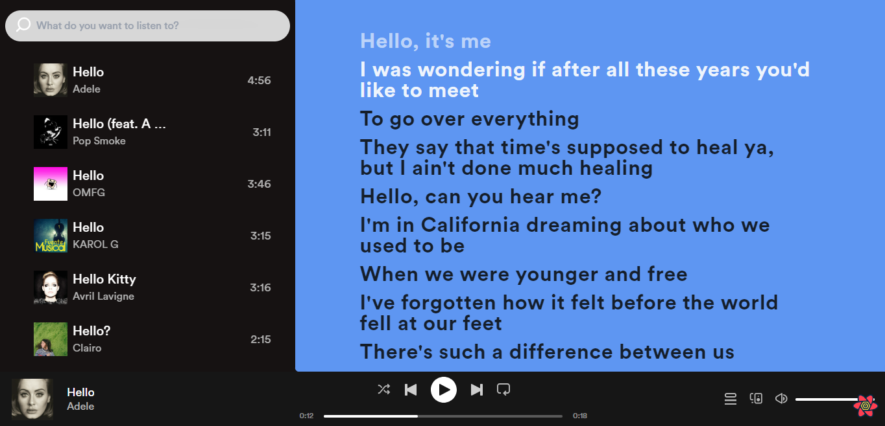

# Audio Player Web App

This repository contains a simple web application called "Audio Player" that allows users to listen to audio files. The application is built using React and utilizes context Api to manage all the states.

## Features

- Play and pause audio files
- Display the duration and progress of the currently playing audio
- Seek to a specific position in the audio file
- Volume editing
- Sync with the lyric while playing
- Display the current time of the audio file
- Selecting the lyrics line while and seek to the specific time ( also in reverse )

## ShowCase :



## Installation

1. Clone the repository to your local machine:

   ```
   git clone https://github.com/BelkacemYerfa/spotify
   ```

2. Run the commands :
   ```
   cd client
   npm run dev
   ```

## Technologies

- ReactJs
- TailwindCss
- react-use-audio-player
- rapidApi
- ContextApi
- @tanstack/react-query

Note : Don't forget to give us a star if you liked the repo
